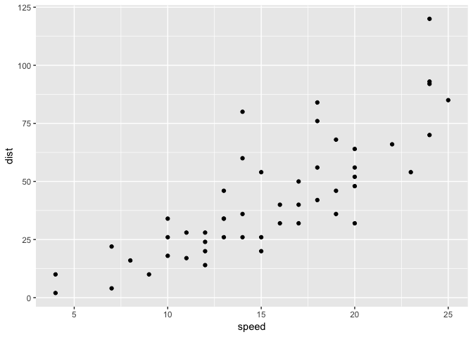

Linear regression is probably one of the most widely used statistical
techniques in all of econometrics/data science. There are a couple
reasons for this; its relatively easy and intuitive to interpret the
model output, it’s not computationally expensive… etc.

For this exercise we’re going to be using the `cars` dataset that ships
with baseR.

    data("cars")

Plotting
--------

    cars %>%
      ggplot() +
      geom_point(aes(speed, dist))

Linear regression is probably one of the most widely used statistical
techniques in all of econometrics/data science. There are a couple
reasons for this; its relatively easy and intuitive to interpret the
model output, it’s not computationally expensive… etc.

In order to properly utilize this technique there are a certain set of
assumptions that must be satisfied. These assumptions are known as the
Gauss-Markov assumptions of Multiple Linear Regression which are named
after some old dudes, Friedrich Gauss and Andrey Markov. These
assumptions are as follows:

1.  Linear in the parameters
2.  Random Sampling
3.  No *Perfect* collinearity
4.  Zero conditional mean - the expected value of u given x = 0
5.  Homoskedasticity

With it being one of the most widely used techniques, its shocking to
see how many people in practice don’t even consider these assumptions
when doing their modeling, and for those that do, how misinformed they
are with the true meaning of them. I’ve read some of the craziest things
on forums like [reddit](https://reddit.com/r/datascience). I just wanted
to quickly talk through some of these assumptions that I see some of the
most egregious misunderstandings.

Linear in the parameters
------------------------

This is probably this most misconstrued of all the assumptions, most
likely due to the words “*linear*.” I often see people say you can
**only** use this if the relationship you’re modeling is linear.
