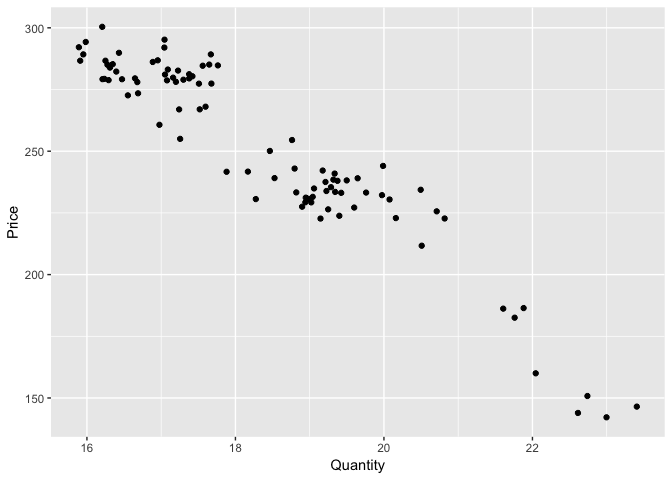
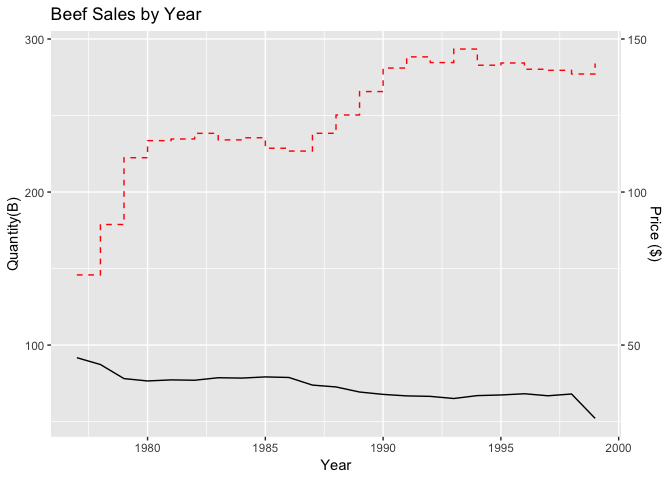
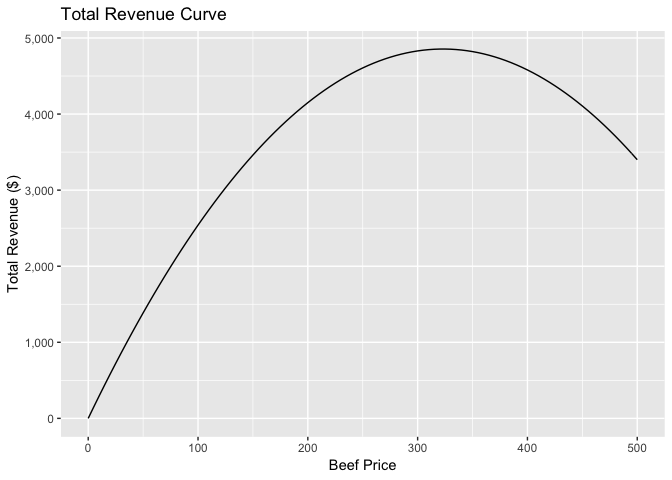

I’ve seen a few people do examples of price optimization problems,
however one thing I havent seen done is using calculus to obtain the
optimal price for the product/service. In this quick example im going to
demonstrate how to do this.

Package Load
------------

    library(dplyr)
    library(ggplot2)
    library(stats) #optimization
    library(broom) #tidy model output
    library(scales)
    library(stargazer)

Data
----

For this exercise we are using beef sales data by quarter that ranges
from 1977 - 1999. We can take a quick look at what that looks like to
get familiar with our dataset.

    head(demand.data)

    ##   Year Quarter Quantity    Price
    ## 1 1977       1  22.9976 142.1667
    ## 2 1977       2  22.6131 143.9333
    ## 3 1977       3  23.4054 146.5000
    ## 4 1977       4  22.7401 150.8000
    ## 5 1978       1  22.0441 160.0000
    ## 6 1978       2  21.7602 182.5333

We can see average price of beef is $250 over the time period.

    summary(demand.data)

    ##       Year         Quarter         Quantity         Price      
    ##  Min.   :1977   Min.   :1.000   Min.   :15.89   Min.   :142.2  
    ##  1st Qu.:1982   1st Qu.:1.500   1st Qu.:17.04   1st Qu.:231.3  
    ##  Median :1988   Median :2.000   Median :18.17   Median :250.1  
    ##  Mean   :1988   Mean   :2.484   Mean   :18.40   Mean   :250.4  
    ##  3rd Qu.:1994   3rd Qu.:3.000   3rd Qu.:19.36   3rd Qu.:280.7  
    ##  Max.   :1999   Max.   :4.000   Max.   :23.41   Max.   :300.4

Data Exploration
----------------

Here we are just taking a look at the cross-sectional relationship
between price and demand for beef, there’s a pretty clear negative
relationship.

    demand.data %>%
      ggplot(aes(Quantity, Price)) +
        geom_point() 

Looking at aggregated sales by year and overlaying price to look at the
relationship.

    demand.data %>%
      group_by(Year) %>%
      summarise(totalQuantity = sum(Quantity),
                avgPrice = mean(Price)) %>%
      ggplot() +
        geom_line(aes(Year, totalQuantity)) +
        geom_step(aes(Year, avgPrice), color = "red", linetype = "dashed") +
        labs(title = "Beef Sales by Year", x = "Year", y = "Quantity Sold") +
        scale_y_continuous("Quantity(B)", sec.axis = sec_axis(~. / 2, name = "Price ($)")) +
        theme()

Estimating the demand equation
------------------------------

Now that we have our data its time to do the modeling

Model specification, that is, which variables should be included or
excluded in your model is the **most important** part of this entire
process (aside from having reliable data - im sure you’ve heard of
garbage in garbage out). The optimization on the back end is relatively
easy, it’s just a bit of algebra and calculus and with R just one line
of code. If our model is misspecified our coefficients will be biased,
that is, our estimated effect of price on demand will be inaccurate and
the resulting optimization will be incorrect.

In plain english this means the price you set will be wrong and you will
not be maximizing revenue.

As an example, lets say we’re modeling beef demand and we don’t include
the price of chicken (a substitue) in our model. If beef price stays the
same and the price of chicken decreases, consumers will start to buy
more chicken as it’s gotten relatively cheaper to beef. In a model that
doesnt include the price of chicken our price effect will be wrong.

Since we are trying to uncover a casual relationship between price and
demand we must think carefully and critically about the other variables
that influence demand. Also, we must be cognizant to make sure we are
not violating the [Gauss-Markov
assumptions](https://en.wikipedia.org/wiki/Gauss–Markov_theorem) which
ill cover in more detail in another post. *In the example above if we
had an omitted variable, like the price of chicken, we would be
violating the strict exogeniety assumption.*

    demand.model <- lm(Quantity ~ Price + Year, data = demand.data)

For the sake of brevity, we are going to assume that we only the price
of beef in our model. Also, we are going to assume that this model is
amazing. We’ve controlled for all the necessary variables, We would
normally be checking our model diagnostics, thinking from a theoretical
standpoint if our model is correctly specified - validating if our model
is violating any of the Gauss-markov assumptions of regression etc…

How to evaluate the model is any good or not will be a post for another
day.

    stargazer(demand.data)

    ## 
    ## % Table created by stargazer v.5.2.2 by Marek Hlavac, Harvard University. E-mail: hlavac at fas.harvard.edu
    ## % Date and time: Sun, Jun 23, 2019 - 19:55:00
    ## \begin{table}[!htbp] \centering 
    ##   \caption{} 
    ##   \label{} 
    ## \begin{tabular}{@{\extracolsep{5pt}}lccccccc} 
    ## \\[-1.8ex]\hline 
    ## \hline \\[-1.8ex] 
    ## Statistic & \multicolumn{1}{c}{N} & \multicolumn{1}{c}{Mean} & \multicolumn{1}{c}{St. Dev.} & \multicolumn{1}{c}{Min} & \multicolumn{1}{c}{Pctl(25)} & \multicolumn{1}{c}{Pctl(75)} & \multicolumn{1}{c}{Max} \\ 
    ## \hline \\[-1.8ex] 
    ## Year & 91 & 1,987.879 & 6.604 & 1,977 & 1,982 & 1,993.5 & 1,999 \\ 
    ## Quarter & 91 & 2.484 & 1.119 & 1 & 1.5 & 3 & 4 \\ 
    ## Quantity & 91 & 18.403 & 1.813 & 15.892 & 17.044 & 19.359 & 23.405 \\ 
    ## Price & 91 & 250.440 & 37.010 & 142.167 & 231.333 & 280.717 & 300.400 \\ 
    ## \hline \\[-1.8ex] 
    ## \end{tabular} 
    ## \end{table}

    summary(demand.model)

    ## 
    ## Call:
    ## lm(formula = Quantity ~ Price + Year, data = demand.data)
    ## 
    ## Residuals:
    ##      Min       1Q   Median       3Q      Max 
    ## -1.00028 -0.45690  0.05008  0.35813  1.28697 
    ## 
    ## Coefficients:
    ##              Estimate Std. Error t value Pr(>|t|)    
    ## (Intercept) 76.283068  34.619969   2.203   0.0302 *  
    ## Price       -0.042878   0.003169 -13.532   <2e-16 ***
    ## Year        -0.023714   0.017757  -1.335   0.1852    
    ## ---
    ## Signif. codes:  0 '***' 0.001 '**' 0.01 '*' 0.05 '.' 0.1 ' ' 1
    ## 
    ## Residual standard error: 0.5708 on 88 degrees of freedom
    ## Multiple R-squared:  0.9031, Adjusted R-squared:  0.9009 
    ## F-statistic: 410.1 on 2 and 88 DF,  p-value: < 2.2e-16

Demand Equation
---------------

Here is a general demand function:

*Q* = *β*0 + *β*1*P**r**i**c**e*

Here is our estimated demand function coming straight from our model
output.

*Q* = 30.05 − .0465*P*

In english this says, for every $1 increase in price, on average the
quantity of beef sales will decrease by .04 (units?) whatever a unit of
beef is measure in this dataset.

Lets save our demand function for later use…

    demand.equation <- function(x){
      (x)*(30.05-.0465*x)
    }

Price Optimization
------------------

Now this is where the example is going to diverge from what I’ve seen
others do… By all means the way others have done it is completely
correct. What I’ve seen typically done is people will generate a vector
of arbitrary prices, say $0 - $1,000 and evaluate their demand equation
at each price and see what the estimated revenue will be. This
definitely works, but in my opinion there’s a far more efficient and
sophisticated way to solve this problem. After all, I dont want to let
all those hours studying math go to waste.

The Math!
---------

In this example we want to maximize revenue of beef sales with respect
to the price of beef. We could maximize profit and in that case we would
consider costs in our equation, however for this example we are going to
stick with revenue.

If we were going to understand what our total revenue (TR) of sales was
it would simply be the quanity of products sold (Q) multiplied by the
price of those products (P), the resulting equation is below.

*T**R* = *P**Q*

Remember, we have an equation for Q - which is our model we just
estimated above. We can substitue our estimated demand function in the
equation above. Once that’s done we have:

*T**R* = *P*(30.05 − .0465*P*)

After some alebra we now have our estimated total revenue function for
beef demand.

*T**R* = 30.05*P* − .0465*P*2

Now for some calculus. The sign of our first derivative is very
imformative, if its positive that means the slope is increasing, if its
negative our line is decreasing and if its 0 that means its flat. In
this instance we can take the first derivative of our demand function
with respect to price, set that equation equal to 0 and solve for price.
Setting the function = 0 and solving will yield what the revenue
maximizing price will be.

Setting it equal to 0 means the slope of the line at the price is flat…
We’ll see an example below. Lucky for us, we dont have to handwrite our
math and we have this optimize function out of the stats package that
will do all the heavy lifting for us.

    stats::optimize(demand.equation, lower = 0, upper = 500, maximum = TRUE)$maximum

    ## [1] 323.1183

Using the above function, which is doing the calculus for us, we see
that our revenue maximizing price is $323.

Total Revenue Curve
-------------------

In this particular example we are optimizing price to maximize revenue.
I understand that’s not always the metric that we are trying to
maximize. We can also extend this and maximize profit, for that we will
just need to include cost in our equation and obtain a profit function
rather than just a total revenue function. (just a bit more algebra)

      ggplot(data.frame(price = 0:500), aes(price)) +
        stat_function(fun = demand.equation, geom = 'line') +
        labs(title = "Total Revenue Curve", x = "Beef Price", y = "Total Revenue ($)") +
        scale_y_continuous(labels = comma)

